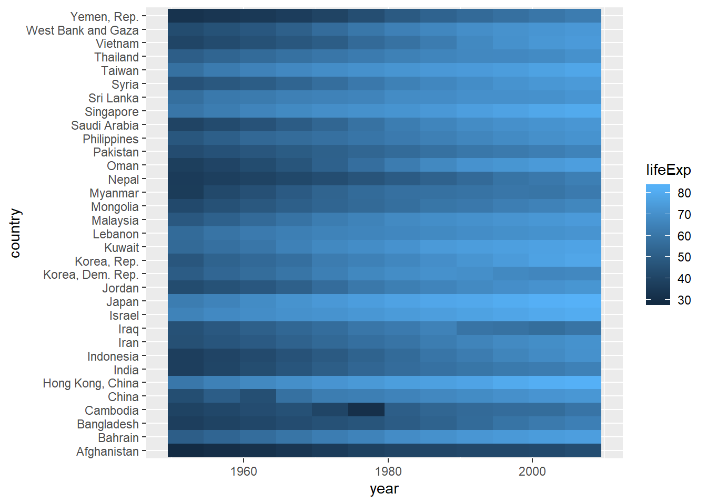
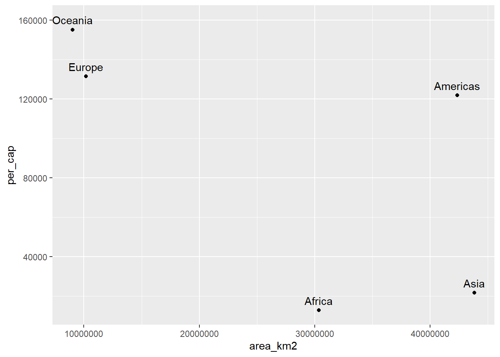

# Joins {-}

Estamos juntando dados de tabelas o tempo todo. Por diversos motivos parte das informações estão em uma tabela e parte estão em outra e precisamos parear esses dados para seguir com a análise. No Excel essa movimentação é feita pela função `PROCV()`, só que de maneira mais limitada.

O pacote `dplyr` fornece uma família de funções para trabalhar com 'joins' no R. Vamos ver como as principais funcionam e como podemos aplicar nas nossas análises.

Primeiro, temos que ter claro que iremos fazer a operação com duas tabelas e deixar claro quem é a tabela 1 (esquerda) e a tabela 2 (direita). A tabela 1 normalmente é nossa referencia e a partir dela iremos buscar algumas ou todas informações da tabela 2 a partir de pontos em comum. Veja no esquema abaixo as 4 principais que envolvem 'joins'.


```r
library(tidyverse)

set.seed(12345)

x <- tibble(
  chave = LETTERS[c(1:3, 5)], 
  valor1 = sample(1:10, 4)
)

y <- tibble(
  chave = LETTERS[c(1:4)], 
  valor2 = sample(1:10, 4),
  valor3 = sample(20:30, 4)
)
```

Com base na tabela `x`, traga os valores da tabela `y` que correspondam com as chaves que existem na tabela `x`. Notem que a tabela 1 é o objeto `x` e eu quero ele como referencia.


```r
left_join(x, y, by = "chave")
```

Mas se eu quiser utilizar a tabela do objeto `y` como referência, ou eu mudo os objetos de posição na função ou utilizo a função `right_join`.


```r
right_join(x, y, by = "chave")
```

Agora, considerando apenas o que tem em comum nas duas tabelas e depois o juntando todas as possibilidades.


```r
inner_join(x, y)

full_join(x, y)
```

Vimos até agora os 'joins' que movimentam colunas de uma tabela para outra, mas há os 'joins' que servem para filtrar linhas na tabela de referencia e não movimentam informações entre as tabelas. O `semi_join` mantém os registros com base na coluna `chave` que existem nas duas tabelas. Já o `anti_join` mantém o registro que existe na tabela 1, mas não na tabela 2.


```r
semi_join(x, y)

anti_join(x, y)
```


## Exercícios {-}

(@) **Carregue o pacote `gapminder` aplique a função `glimpse` na objeto `gapminder` que pertence ao respectivo pacote.**


```
#> Observations: 1,704
#> Variables: 6
#> $ country   <fct> Afghanistan, Afghanistan, Afghanistan, Afghanistan, ...
#> $ continent <fct> Asia, Asia, Asia, Asia, Asia, Asia, Asia, Asia, Asia...
#> $ year      <int> 1952, 1957, 1962, 1967, 1972, 1977, 1982, 1987, 1992...
#> $ lifeExp   <dbl> 28.801, 30.332, 31.997, 34.020, 36.088, 38.438, 39.8...
#> $ pop       <int> 8425333, 9240934, 10267083, 11537966, 13079460, 1488...
#> $ gdpPercap <dbl> 779.4453, 820.8530, 853.1007, 836.1971, 739.9811, 78...
```
<br>

(@) **Importe o arquivo `continents.xlsx` e mostre seu conteúdo na tela.**


```
#> # A tibble: 6 x 4
#>   continent  area_km2 population percent_total_pop
#>   <chr>         <dbl>      <dbl>             <dbl>
#> 1 Africa     30370000 1022234000              15  
#> 2 Americas   42330000  934611000              14  
#> 3 Antarctica 13720000       4490               0  
#> 4 Asia       43820000 4164252000              60  
#> 5 Europe     10180000  738199000              11  
#> 6 Oceania     9008500   29127000               0.4
```
<br>

(@) **Faça um join entre a tabela `gapminder` e `continents`, onde `gapminder` será a tabela de referência. Salve essa operação em um objeto chamado `gap_cont`.**


```
#> # A tibble: 1,704 x 9
#>    country continent  year lifeExp    pop gdpPercap area_km2 population
#>    <fct>   <chr>     <int>   <dbl>  <int>     <dbl>    <dbl>      <dbl>
#>  1 Afghan~ Asia       1952    28.8 8.43e6      779. 43820000 4164252000
#>  2 Afghan~ Asia       1957    30.3 9.24e6      821. 43820000 4164252000
#>  3 Afghan~ Asia       1962    32.0 1.03e7      853. 43820000 4164252000
#>  4 Afghan~ Asia       1967    34.0 1.15e7      836. 43820000 4164252000
#>  5 Afghan~ Asia       1972    36.1 1.31e7      740. 43820000 4164252000
#>  6 Afghan~ Asia       1977    38.4 1.49e7      786. 43820000 4164252000
#>  7 Afghan~ Asia       1982    39.9 1.29e7      978. 43820000 4164252000
#>  8 Afghan~ Asia       1987    40.8 1.39e7      852. 43820000 4164252000
#>  9 Afghan~ Asia       1992    41.7 1.63e7      649. 43820000 4164252000
#> 10 Afghan~ Asia       1997    41.8 2.22e7      635. 43820000 4164252000
#> # ... with 1,694 more rows, and 1 more variable: percent_total_pop <dbl>
```
<br>


(@) **Com base no objeto `gap_cont`, filtre as informações do continente `Antarctica`.**


```
#> # A tibble: 24 x 9
#>    country continent  year lifeExp    pop gdpPercap area_km2 population
#>    <fct>   <chr>     <int>   <dbl>  <int>     <dbl>    <dbl>      <dbl>
#>  1 Austra~ Oceania    1952    69.1 8.69e6    10040.  9008500   29127000
#>  2 Austra~ Oceania    1957    70.3 9.71e6    10950.  9008500   29127000
#>  3 Austra~ Oceania    1962    70.9 1.08e7    12217.  9008500   29127000
#>  4 Austra~ Oceania    1967    71.1 1.19e7    14526.  9008500   29127000
#>  5 Austra~ Oceania    1972    71.9 1.32e7    16789.  9008500   29127000
#>  6 Austra~ Oceania    1977    73.5 1.41e7    18334.  9008500   29127000
#>  7 Austra~ Oceania    1982    74.7 1.52e7    19477.  9008500   29127000
#>  8 Austra~ Oceania    1987    76.3 1.63e7    21889.  9008500   29127000
#>  9 Austra~ Oceania    1992    77.6 1.75e7    23425.  9008500   29127000
#> 10 Austra~ Oceania    1997    78.8 1.86e7    26998.  9008500   29127000
#> # ... with 14 more rows, and 1 more variable: percent_total_pop <dbl>
```
<br>

(@) **Faça um heatmap considerando apenas os países da `asia`, onde no eixo x temos o `year`, no eixo y o `country` e na dimensão de preenchimento `lifeExp`**

Dicas: filter, geom_tile.




(@) **Faça um gráfico de dispersão com a area do continente e a renda per capta. Para isso, considere `GDP = gdpPercap * pop` como o PIB do país. Em seguida some o PIB em função do continente. A tabela `continents` informa a população do continente, divida o PIB do continente pela população do mesmo e salve e chame essa variável de `per_cap`, faça o gráfico proposto em seguida.**

Dicas: summarize, left_join, geom_text, nudge_y.




